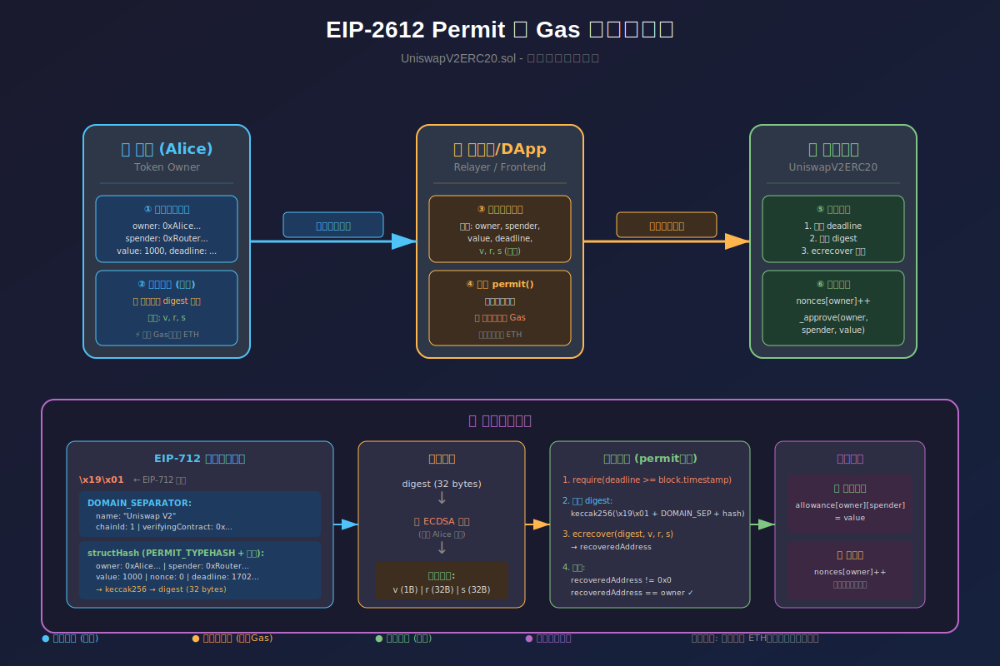

# UniswapV2ERC20.sol 学习笔记

---

## 一、ERC20 标准函数

### 1.1 状态变量
```solidity
string public constant name = 'Uniswap V2';      // 代币名称
string public constant symbol = 'UNI-V2';        // 代币符号  
uint8 public constant decimals = 18;             // 精度
uint public totalSupply;                          // 总供应量
mapping(address => uint) public balanceOf;        // 余额映射
mapping(address => mapping(address => uint)) public allowance;  // 授权额度
```


### 1.2 变量说明

- 下面三个变量都是给 **EIP-712 离线签名（permit）** 准备的

1. `PERMIT_TYPEHASH：`  它的值是 **“Permit(address owner,address spender,uint256 value,uint256 nonce,uint256 deadline)”** 这个字符串 keccak256 后的哈希值，只是提前在源码里硬编码好，链上不需要每次重新算，省一次哈希开销。

2. `nonces`：表示每个地址已经用过多少次 permit。在后续的permit()方法，  源代码87行位置里必须带当前 nonce。

   > `keccak256(abi.encode(PERMIT_TYPEHASH, owner, spender, value, nonces[owner]++, deadline))`  ，执行完后 `nonces[owner]++`，防止同一份签名被重复提交（replay attack）。

3. `DOMAIN_SEPARATOR`：它是在构造函数里拼好的 EIP-712“域名哈希”，把合约地址、链 ID、名字、版本等固定信息压成一个哈希。作用：让签名只在

   - 该合约
   - 该链
   - 该版本上有效，防止跨合约/跨链重放。


### 1.3 构造方法说明

> 这段构造函数只做一件事：
>
> **给 EIP-712 的“域名分隔符”DOMAIN_SEPARATOR 赋值**，以便后面permit()离线签名时能验证“这份签名只属于本合约、本链、本版本”。

- keccak256('EIP712Domain(string name,string version,uint256 chainId,address verifyingContract)')
- 为了给机器看的，是在 EIP-712 标准 里充当 “类型描述符的哈希”——官方叫 typeHash。

```
constructor() public {
        uint chainId;
        assembly {
            chainId := chainid   //0.5.16 还没有全局变量 block.chainid，只能用汇编；0.8+后的版本已经内置了。
        }
        DOMAIN_SEPARATOR = keccak256(
            abi.encode(
		       //签名消息的结构类型
                keccak256('EIP712Domain(string name,string version,uint256 chainId,address verifyingContract)'),
                keccak256(bytes(name)), //token 名称的哈希，name = 'Uniswap V2'
                keccak256(bytes('1')),  //版本号写死为字符串 '1'
                chainId,                //让签名只在当前链有效
                address(this)           //让签名只在当前合约地址有效
            )
        );
    }
```

> 关于 address（this）的说明：

###### 含义：

“把**本合约的地址**写进 DOMAIN_SEPARATOR，让离线签名只能给这个**特定的 LP 代币合约**使用，防止签名被拿到别的池子/别的代币那里重放。”

###### 所以：

- 每部署一个新的 pair（即新建一个 `UniswapV2ERC20` 实例），`address(this)` 都是**全新的 pair 地址**。
- 用户收到的 `UNI-V2` 代币合约地址，就是这里的 `address(this)`。

> 以后任何人用 `permit()` 提交离线签名时，合约都会把 `DOMAIN_SEPARATOR` 再混进去算一次最终哈希

###### 确保：

- 签名不是另一条链的重放
- 签名不是另一个合约的重放
- 签名不是旧版本的重放

**DOMAIN_SEPARATOR 就是“这份签名只能给本合约用”的边界标识。**


### 1.4 核心函数

| 函数                              | 作用                             | 可见性   |
| --------------------------------- | -------------------------------- | -------- |
| `_mint(to, value)`                | 铸造代币，增加总供应量和目标余额 | internal |
| `_burn(from, value)`              | 销毁代币，减少余额和总供应量     | internal |
| `_approve(owner, spender, value)` | 设置授权额度                     | private  |
| `_transfer(from, to, value)`      | 转移代币                         | private  |
| `approve(spender, value)`         | 外部授权接口                     | external |
| `transfer(to, value)`             | 外部转账接口                     | external |
| `transferFrom(from, to, value)`   | 授权转账接口                     | external |

### 1.5 transferFrom 的无限授权优化
```solidity
if (allowance[from][msg.sender] != uint(-1)) {
    allowance[from][msg.sender] = allowance[from][msg.sender].sub(value);
}
```
- **`uint(-1)`** = 2^256-1，表示"无限授权"
- **优化点**：无限授权时跳过 SSTORE 操作，节省 ~5000 gas

---

## 二、permit() 无 Gas 授权原理

### 2.1 函数签名
```solidity
function permit(
    address owner,      // 代币持有者（授权人）
    address spender,    // 被授权人
    uint value,         // 授权额度
    uint deadline,      // 签名过期时间戳
    uint8 v,            // 签名参数 v
    bytes32 r,          // 签名参数 r
    bytes32 s           // 签名参数 s
) external
```

### 2.2 作用
允许用户通过**离线签名**的方式授权代币给某个地址使用，无需发送 `approve` 交易。

### 2.3 关键逻辑

**Step 1: 过期检查**

```solidity
require(deadline >= block.timestamp, 'UniswapV2: EXPIRED');
```

**Step 2: 构造签名消息摘要**

```solidity
bytes32 digest = keccak256(
    abi.encodePacked(
        '\x19\x01',                    // EIP-712 固定前缀
        DOMAIN_SEPARATOR,              // 域分隔符（防跨链/跨合约重放）
        keccak256(abi.encode(
            PERMIT_TYPEHASH,           // 结构化类型哈希
            owner,
            spender, 
            value,
            nonces[owner]++,           // 使用后自增
            deadline
        ))
    )
);
```

**Step 3: 签名验证**
```solidity
address recoveredAddress = ecrecover(digest, v, r, s);
require(recoveredAddress != address(0) && recoveredAddress == owner, 'UniswapV2: INVALID_SIGNATURE');
```

**Step 4: 执行授权**
```solidity
_approve(owner, spender, value);
```

### 2.4 工作流程图

##### 流程图上半部分：三大角色交互

| 角色               | 核心操作                                    |
| ------------------ | ------------------------------------------- |
| **👤 用户 (Alice)** | ① 构造签名消息 → ② 私钥离线签名生成 v,r,s   |
| **🔄 中继者/DApp**  | ③ 接收签名数据 → ④ 调用 permit() 并支付 Gas |
| **📜 智能合约**     | ⑤ 验证签名 → ⑥ 执行授权                     |



##### 流程图下半部分：详细数据流转

1. **EIP-712 签名消息结构**：`\\\\x19\\\\x01` + DOMAIN_SEPARATOR + structHash
2. **签名生成**：digest → ECDSA 签名 → v, r, s
3. **链上验证**：deadline 检查 → 重建 digest → ecrecover → 地址比对
4. **执行结果**：allowance 更新 + nonce 自增

```
用户(离线)                           链上
    |                                  |
    |-- 1. 构造 permit 消息 -------->   |
    |-- 2. 用私钥签名(v,r,s) ------>    |
    |                                  |
    |-- 3. 将签名发给中继者/Dapp -->    |
    |                                  |
    |   中继者调用 permit(...)  ----->  | 4. 验证签名
    |                                  | 5. 执行 _approve()
    |                                  |
```

---

## 三、DOMAIN_SEPARATOR 和 PERMIT_TYPEHASH 的作用

### 3.1 DOMAIN_SEPARATOR（域分隔符）

**构造方式：**
```solidity
DOMAIN_SEPARATOR = keccak256(
    abi.encode(
        keccak256('EIP712Domain(string name,string version,uint256 chainId,address verifyingContract)'),
        keccak256(bytes(name)),        // "Uniswap V2"
        keccak256(bytes('1')),         // 版本 "1"
        chainId,                        // 链 ID
        address(this)                   // 合约地址
    )
);
```

**作用：唯一标识签名的上下文环境**

| 字段                | 防护目的               |
| ------------------- | ---------------------- |
| `name`              | 区分不同协议           |
| `version`           | 区分同一协议的不同版本 |
| `chainId`           | **防止跨链重放攻击**   |
| `verifyingContract` | **防止跨合约重放攻击** |

### 3.2 PERMIT_TYPEHASH（类型哈希）

- 来源及生成方式前面在[变量说明](#1.2-变量说明)的地方已经解释过，此处不再重复。

```solidity
bytes32 public constant PERMIT_TYPEHASH = 0x6e71edae12b1b97f4d1f60370fef10105fa2faae0126114a169c64845d6126c9;
// = keccak256("Permit(address owner,address spender,uint256 value,uint256 nonce,uint256 deadline)")
```

**作用：**

- 定义签名消息的**结构类型**
- 确保签名内容的格式一致性
- 用户钱包可据此显示可读的签名内容（而非盲签）

---

## 四、ecrecover 签名验证

### 4.1 函数原型
```solidity
function ecrecover(bytes32 hash, uint8 v, bytes32 r, bytes32 s) returns (address)
```

### 4.2 参数说明
| 参数       | 说明                                  |
| ---------- | ------------------------------------- |
| `hash`     | 被签名的消息摘要（32字节）            |
| `v`        | 恢复标识符（27 或 28）                |
| `r`        | 签名的前32字节                        |
| `s`        | 签名的后32字节                        |
| **返回值** | 签名者的地址（失败返回 `address(0)`） |

### 4.3 验证逻辑
```solidity
address recoveredAddress = ecrecover(digest, v, r, s);
require(recoveredAddress != address(0) && recoveredAddress == owner, 'UniswapV2: INVALID_SIGNATURE');
```
- **检查1**：`!= address(0)` — 签名格式有效
- **检查2**：`== owner` — 签名者确实是声明的 owner

---

## 五、疑问解答

### Q1: 为什么需要 nonce？
**答：防止签名重放攻击**

```solidity
nonces[owner]++  // 每次使用后自增
```

- 每个地址维护独立的 nonce 计数器
- 同一签名只能使用一次
- 攻击者无法重复提交已使用的签名

**场景示例：**

```
签名1: nonce=0, value=100 → 使用后 nonce 变为 1
攻击者重放签名1 → 失败，因为当前 nonce=1，不匹配
```

### Q2: 为什么需要 deadline？
**答：限制签名有效期**

```solidity
require(deadline >= block.timestamp, 'UniswapV2: EXPIRED');
```

- 防止旧签名被无限期使用
- 用户可控制授权的时间窗口
- 即使签名泄露，过期后也无法使用

### Q3: permit() 和 approve() 有什么区别？

| 对比项         | approve()             | permit()                   |
| -------------- | --------------------- | -------------------------- |
| **交易发起者** | 必须是 owner 本人     | 任何人（中继者）           |
| **Gas 支付**   | owner 支付            | 调用者支付                 |
| **需要 ETH**   | 是                    | 否（owner 无需 ETH）       |
| **交互次数**   | 2次（approve + 操作） | 1次（permit + 操作可合并） |
| **用户体验**   | 需要两次签名确认      | 一次离线签名               |

---

## 六、验证问题答案

### ✅ Q1: permit 相比 approve 有什么优势？

1. **无需 Gas**：用户无需持有 ETH 即可授权
2. **更好的 UX**：一次签名完成授权+操作（如 Router 的 `removeLiquidityWithPermit`）
3. **元交易支持**：第三方可代付 Gas（Gasless Transaction）
4. **减少交易数**：从 2 笔交易（approve + swap）减少为 1 笔

### ✅ Q2: 为什么需要 nonce？

**核心目的：防止签名重放攻击**

```
攻击场景（无 nonce）：
1. Alice 签名授权 100 UNI-V2 给 Bob
2. Bob 提交签名，获得授权
3. Bob 再次提交同一签名 → 又获得 100 授权 ❌

有 nonce 保护：
1. Alice 签名（nonce=0）授权 100
2. Bob 提交，nonce 变为 1
3. Bob 重放签名（nonce=0）→ 失败 ✅
```

### ✅ Q3: DOMAIN_SEPARATOR 如何防止跨链重放攻击？

**机制：将 chainId 编码进签名消息**

```solidity
DOMAIN_SEPARATOR = keccak256(abi.encode(
    ...,
    chainId,           // 关键：链 ID
    address(this)      // 合约地址
));
```

**防护原理：**

```
以太坊主网签名：chainId = 1
攻击者在 BSC 重放：chainId = 56

BSC 上的 DOMAIN_SEPARATOR 不同
→ 计算出的 digest 不同
→ ecrecover 恢复出的地址 ≠ owner
→ 验证失败 ✅
```

**同理防止跨合约重放：**

- 不同合约的 `address(this)` 不同
- 即使同一链上，签名也无法在其他合约使用

---

## 七、核心知识点总结

```
┌─────────────────────────────────────────────────────────┐
│                    EIP-712 签名结构                      │
├─────────────────────────────────────────────────────────┤
│  \x19\x01                                               │
│  ├── DOMAIN_SEPARATOR (防跨链/跨合约重放)                │
│  │   ├── name: "Uniswap V2"                            │
│  │   ├── version: "1"                                  │
│  │   ├── chainId: 1/56/...                             │
│  │   └── verifyingContract: 0x...                      │
│  └── structHash (具体操作数据)                          │
│      ├── PERMIT_TYPEHASH                               │
│      ├── owner, spender, value                         │
│      ├── nonce (防重放)                                 │
│      └── deadline (防过期)                              │
└─────────────────────────────────────────────────────────┘
```