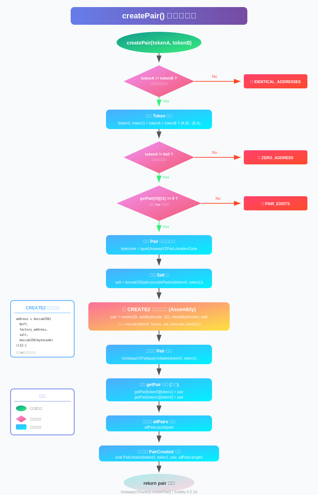
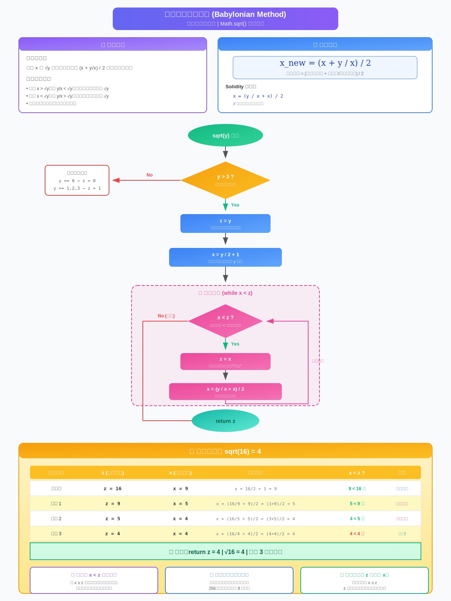

# UniswapV2Factory 合约学习笔记

> 学习日期：2025年12月11日  
> 合约版本：Solidity 0.5.16

---

## 目录
1. [合约概览](#1-合约概览)
2. [状态变量详解](#2-状态变量详解)
3. [核心函数 createPair() 深度解析](#3-核心函数-createpair-深度解析)
4. [CREATE2 部署机制](#4-create2-部署机制)
5. [UQ112x112 定点数表示法](#5-uq112x112-定点数表示法)
6. [巴比伦法求平方根](#6-巴比伦法求平方根)
7. [流程图与结构图](#7-流程图与结构图)
8. [疑问与解答](#8-疑问与解答)
9. [源码逐行注释](#9-源码逐行注释)

---

## 1. 合约概览

### 1.1 合约作用
`UniswapV2Factory` 是 Uniswap V2 协议的**工厂合约**，负责：
- 创建和管理所有交易对（Pair）合约
- 记录所有已创建的交易对地址
- 管理协议手续费收取地址

### 1.1.1 Pari 合约的说明（声明）

`该合约第三天会学习到，因当前合约引入了需要提前声明一下`

把“Pair 地址”想成**一只自动售货机**，更好理解。

- **它先被工厂“生出来”**
   - 工厂用 CREATE2 把一段字节码（UniswapV2Pair 合约）部署到链上，
   - 链上立即得到一个**固定长度 20 字节的地址**，这就是 pair 地址。
-  **它肚子里只放两种币**
   - 比如 USDT–WETH 池，这个地址的余额里就永远只有 `balanceOf(USDT)` 和 `balanceOf(WETH)`。
   - 别人往这个地址打币，就等于**往售货机里投币**。
-  **它身上挂着三块“功能牌”**
   - `swap(x, y, to)`：投 A 拿 B，瞬间换完。
   - `mint(to)`：按比例给它两种币，它回赠“LP 代币”——代表你持有售货机里所有币的**股份**。
   - `burn(to)`：把 LP 代币还给它，它把两种币按比例退给你，同时把累计手续费也一起退。
-  **它自己就是“行情盘”**
   - 每次有人交易，它都会用 `x * y = k` 重新定价，
   - 前端/套利机器人直接读它的 `reserve0`、`reserve1` 就能算出当前汇率。
-  **它永不跑路、永不升级**
   - 代码写死后没人能改，
   - 连工厂都指挥不了它，唯一能做的就是收手续费开关（通过 `feeTo` 变量）。

> 一句话：
> **pair 地址 = “两种币自动兑换机”+“股份记账本”**。
> 你所有“添加流动性”、“撤流动性”、“币币兑换”操作，其实都是跟这个合约地址打交道。

### 1.2 合约继承关系
```
IUniswapV2Factory (接口)
        ↑
UniswapV2Factory (实现)
```

### 1.3 合约结构图
```
┌─────────────────────────────────────────────────────────────┐
│                    UniswapV2Factory                         │
├─────────────────────────────────────────────────────────────┤
│ 状态变量:                                                    │
│   ├── feeTo: address          (手续费接收地址)               │
│   ├── feeToSetter: address    (手续费设置权限地址)           │
│   ├── getPair: mapping        (token对 → pair地址)          │
│   └── allPairs: address[]     (所有pair地址数组)             │
├─────────────────────────────────────────────────────────────┤
│ 函数:                                                        │
│   ├── constructor(_feeToSetter)                             │
│   ├── allPairsLength() → uint                               │
│   ├── createPair(tokenA, tokenB) → address  [核心函数]      │
│   ├── setFeeTo(_feeTo)                                      │
│   └── setFeeToSetter(_feeToSetter)                          │
├─────────────────────────────────────────────────────────────┤
│ 事件:                                                        │
│   └── PairCreated(token0, token1, pair, pairIndex)          │
└─────────────────────────────────────────────────────────────┘
```

---

## 2. 状态变量详解

### 2.1 feeTo
```solidity
address public feeTo;
```
- **作用**：协议手续费接收地址
- **默认值**：`address(0)`（零地址，表示不收取协议费）
- **影响**：当 `feeTo != address(0)` 时，每次交易的 0.3% 手续费中，有 1/6（即 0.05%）归协议所有

### 2.2 feeToSetter
```solidity
address public feeToSetter;
```
- **作用**：有权修改 `feeTo` 和 `feeToSetter` 的管理员地址
- **设置时机**：构造函数中初始化
- **权限控制**：只有此地址可以调用 `setFeeTo()` 和 `setFeeToSetter()`

### 2.3 getPair
```solidity
mapping(address => mapping(address => address)) public getPair;
```
- **作用**：双向映射，通过两个 token 地址查询对应的 pair 地址
- **特点**：`getPair[tokenA][tokenB]` 和 `getPair[tokenB][tokenA]` 返回相同地址

### 2.4 allPairs
```solidity
address[] public allPairs;
```
- **作用**：存储所有已创建的 pair 合约地址
- **用途**：遍历所有交易对、获取交易对总数

---

## 3. 核心函数 createPair() 深度解析

### 3.1 函数签名
```solidity
function createPair(address tokenA, address tokenB) external returns (address pair)
```

### 3.2 执行流程





### 3.3 关键代码解析

#### Token 排序
```solidity
(address token0, address token1) = tokenA < tokenB ? (tokenA, tokenB) : (tokenB, tokenA);
```
**为什么要排序？**

- 确保相同的 token 对总是产生相同的 salt
- 保证 CREATE2 计算出的地址一致
- 无论用户传入 `(A, B)` 还是 `(B, A)`，结果相同

**生活场景举例：**停车场“对号入库”

```

1. 两辆车（代币）同时进场，车牌末尾数字就是它们的“身份证号”。  
2. 保安不管谁先进来，只看数字大小：  
   - 数字小的 → 发 A 区通行证  
   - 数字大的 → 发 B 区通行证  
3. 两辆车必须按“A 前 B 后”的顺序，**停进同一个固定车位**。  
4. 以后任何再来找车的人，只要报这两块车牌，保安都用同一套“A→B”顺序去同一个车位领人。  

这样一来：  
- 不会给同一组车分配两个车位（重复建池）  
- 任何人都能提前算出“它们肯定停在哪”（deterministic 地址）  
- 整个停车场永远整洁、不冲突  

链上排序同理：先比地址大小，小数在前，大数在后，再一起塞进唯一的 Pair 车位，保证全局一致。
```


#### 获取字节码
```solidity
bytes memory bytecode = type(UniswapV2Pair).creationCode;
```
- 这里的`creationCode` 并不是在 **源码文件**里，而是 **编译器在编译的那一刻** 算出来的，是**solidity的内置属性**，它**只存在于编译期**。（使用remix等编译器可以看到）

- `creationCode` 是合约的**创建字节码**（包含构造函数）

- 不同于 `runtimeCode`（运行时字节码，不含构造函数）

- 想亲眼看到它长什么样，可以用下面方法：

  ```
  # 方法1： 使用foundry里的 forge 命令
  forge inspect src/v2-core/contracts/UniswapV2Pair.sol bytecode
  
  # 方法2： 或者用 hardhat
  npx hardhat compile
  cat artifacts/contracts/UniswapV2Pair.sol/UniswapV2Pair.json | jq .bytecode
  ```

- 结果：

  - **一长串 16 进制数**


#### CREATE2 汇编调用
```solidity
assembly {
    pair := create2(0, add(bytecode, 32), mload(bytecode), salt)
}
```
参数解释：
| 参数 | 值 | 含义 |
|------|-----|------|
| value | 0 | 发送的 ETH 数量 |
| offset | add(bytecode, 32) | 字节码起始位置（跳过前32字节长度前缀）|
| size | mload(bytecode) | 字节码长度（存储在前32字节）|
| salt | salt | 盐值（keccak256(token0, token1)）|

---

## 4. CREATE2 部署机制

### 4.1 CREATE vs CREATE2 对比

| 特性 | CREATE | CREATE2 |
|------|--------|---------|
| 地址计算 | `keccak256(sender, nonce)` | `keccak256(0xff, sender, salt, bytecode_hash)` |
| 地址可预测性 | ❌ 依赖 nonce，不可预测 | ✅ 完全确定性，可预测 |
| 链下计算 | ❌ 无法提前知道地址 | ✅ 可在部署前计算地址 |
| 重复部署 | ✅ 可以（nonce 不同）| ❌ 相同参数只能部署一次 |

### 4.2 CREATE2 地址计算公式

```
address = keccak256(
    0xff,                           // 固定前缀
    factory_address,                // 部署者地址
    salt,                           // 盐值 = keccak256(token0, token1)
    keccak256(bytecode)             // 合约字节码哈希
)[12:]                              // 取后20字节作为地址
```

### 4.3 为什么 Uniswap 选择 CREATE2？

```
┌─────────────────────────────────────────────────────────────────┐
│                   CREATE2 的优势                                 │
├─────────────────────────────────────────────────────────────────┤
│                                                                 │
│  1. 【地址可预测】                                               │
│     ├── Router 合约可以在不查询链上数据的情况下计算 pair 地址     │
│     ├── 节省 gas（无需调用 getPair 查询）                        │
│     └── 支持链下计算，提高前端响应速度                           │
│                                                                 │
│  2. 【确定性部署】                                               │
│     ├── 相同的 token 对永远产生相同的 pair 地址                  │
│     ├── 跨链部署时可保持地址一致                                 │
│     └── 便于多链生态整合                                         │
│                                                                 │
│  3. 【防止重复创建】                                             │
│     ├── 相同 salt 只能部署一次                                   │
│     └── 天然防止同一 token 对创建多个 pair                       │
│                                                                 │
│  4. 【无需存储查询】                                             │
│     ├── 任何人都可以通过公式计算 pair 地址                       │
│     └── 减少对 getPair mapping 的依赖                            │
│                                                                 │
└─────────────────────────────────────────────────────────────────┘
```

### 4.4 Router 中的地址计算示例

```solidity
// UniswapV2Library.sol 中的 pairFor 函数
function pairFor(address factory, address tokenA, address tokenB) 
    internal pure returns (address pair) 
{
    (address token0, address token1) = sortTokens(tokenA, tokenB);
    pair = address(uint(keccak256(abi.encodePacked(
        hex'ff',
        factory,
        keccak256(abi.encodePacked(token0, token1)),
        hex'96e8ac4277198ff8b6f785478aa9a39f403cb768dd02cbee326c3e7da348845f' // init code hash
    ))));
}
```

---

## 5. UQ112x112 定点数表示法

### 5.1 什么是 UQ112.112？

UQ112.112 是一种**无符号定点数**表示法：
- **U**：Unsigned（无符号）
- **Q**：Q格式（定点数格式）
- **112.112**：112位整数部分 + 112位小数部分 = 224位

### 5.2 数据结构

```
┌────────────────────────────────────────────────────────────────┐
│                        uint224 (224 bits)                       │
├────────────────────────────────┬───────────────────────────────┤
│     整数部分 (112 bits)         │     小数部分 (112 bits)        │
│     [223:112]                  │     [111:0]                    │
├────────────────────────────────┴───────────────────────────────┤
│  范围: [0, 2^112 - 1]                                           │
│  精度: 1 / 2^112 ≈ 1.93 × 10^-34                                │
└────────────────────────────────────────────────────────────────┘
```

### 5.3 源码解析

```solidity
library UQ112x112 {
    uint224 constant Q112 = 2**112;  // 小数部分的"1"

    // 将 uint112 编码为 UQ112x112
    // 相当于：y * 2^112（左移112位，放入整数部分）
    function encode(uint112 y) internal pure returns (uint224 z) {
        z = uint224(y) * Q112;
    }

    // UQ112x112 除以 uint112
    // 结果仍是 UQ112x112 格式
    function uqdiv(uint224 x, uint112 y) internal pure returns (uint224 z) {
        z = x / uint224(y);
    }
}
```

### 5.4 为什么用 112 位？

- 三个方面考虑

```
┌─────────────────────────────────────────────────────────────────┐
│                    为什么选择 112 位？                            │
├─────────────────────────────────────────────────────────────────┤
│                                                                 │
│  【存储优化 - 关键原因】                                         │
│                                                                 │
│  UniswapV2Pair 中的存储布局：                                    │
│  ┌─────────────────────────────────────────────────────────┐    │
│  │              单个 256-bit 存储槽                         │    │
│  ├──────────────┬──────────────┬────────────────────────────┤    │
│  │  reserve0    │  reserve1    │  blockTimestampLast       │    │
│  │  (112 bits)  │  (112 bits)  │  (32 bits)                │    │
│  ├──────────────┴──────────────┴────────────────────────────┤    │
│  │  112 + 112 + 32 = 256 bits（完美填满一个存储槽）          │    │
│  └─────────────────────────────────────────────────────────┘    │
│                                                                 │
│  【Gas 节省】                                                    │
│  - 读取 reserve0, reserve1, blockTimestampLast 只需 1 次 SLOAD  │
│  - 如果用 uint128，需要 2 个存储槽，gas 翻倍                     │
│                                                                 │
│  【精度足够】                                                    │
│  - 2^112 ≈ 5.19 × 10^33                                         │
│  - 对于 18 位小数的 ERC20，可表示约 5.19 × 10^15 个代币          │
│  - 远超任何实际代币供应量                                        │
│                                                                 │
│  【价格累积器】                                                  │
│  - price0CumulativeLast 和 price1CumulativeLast 使用 uint256    │
│  - UQ112.112 格式的价格 × 时间差，不会轻易溢出                   │
│                                                                 │
└─────────────────────────────────────────────────────────────────┘
```

### 5.5 使用示例（价格计算）

```solidity
// 在 _update() 函数中
price0CumulativeLast += uint(UQ112x112.encode(_reserve1).uqdiv(_reserve0)) * timeElapsed;
```

计算过程：
1. `encode(_reserve1)` → `_reserve1 * 2^112`（转为 UQ112.112）
2. `uqdiv(..., _reserve0)` → `(_reserve1 * 2^112) / _reserve0`（得到价格的 UQ112.112 表示）
3. `* timeElapsed` → 累加时间加权价格

---

## 6. 巴比伦法求平方根

### 6.1 算法原理

巴比伦法（又称牛顿迭代法）是一种古老而高效的求平方根算法：

**核心思想**：如果 `x` 是 `y` 的平方根的一个估计值，那么 `(x + y/x) / 2` 是一个更好的估计值。

**数学推导**：
```
设 x 是 √y 的估计值
如果 x > √y，则 y/x < √y
如果 x < √y，则 y/x > √y
所以 (x + y/x) / 2 总是更接近 √y
```

### 6.2 源码解析

```solidity
function sqrt(uint y) internal pure returns (uint z) {
    if (y > 3) {
        z = y;                    // 初始估计值 = y
        uint x = y / 2 + 1;       // 第一次迭代的估计值
        while (x < z) {           // 当新估计值 < 旧估计值时继续
            z = x;                // 保存当前估计值
            x = (y / x + x) / 2;  // 计算新估计值
        }
    } else if (y != 0) {
        z = 1;                    // 1, 2, 3 的平方根取整都是 1
    }
    // y == 0 时，z 默认为 0
}
```

### 6.3 执行流程图




### 6.5 为什么用巴比伦法？

| 优势 | 说明 |
|------|------|
| **收敛速度快** | 二次收敛，每次迭代精度翻倍 |
| **实现简单** | 只需基本算术运算 |
| **Gas 效率高** | 通常 6-8 次迭代即可收敛 |
| **无需浮点数** | 完全使用整数运算 |

---

## 7. 流程图与结构图

### 7.1 Uniswap V2 整体架构

```
┌─────────────────────────────────────────────────────────────────────────┐
│                         Uniswap V2 架构                                  │
└─────────────────────────────────────────────────────────────────────────┘

                              用户/DApp
                                  │
                                  ▼
                    ┌─────────────────────────┐
                    │    UniswapV2Router02    │  ← 用户交互入口
                    │    (外围合约)            │
                    └─────────────────────────┘
                                  │
                    ┌─────────────┴─────────────┐
                    ▼                           ▼
        ┌─────────────────────┐    ┌─────────────────────┐
        │  UniswapV2Factory   │    │   UniswapV2Pair     │
        │  (核心合约)          │───▶│   (核心合约)         │
        │                     │    │                     │
        │  - createPair()     │    │  - mint()           │
        │  - getPair()        │    │  - burn()           │
        │  - setFeeTo()       │    │  - swap()           │
        └─────────────────────┘    └─────────────────────┘
                                              │
                                   ┌──────────┴──────────┐
                                   ▼                     ▼
                            ┌───────────┐         ┌───────────┐
                            │  Token0   │         │  Token1   │
                            │  (ERC20)  │         │  (ERC20)  │
                            └───────────┘         └───────────┘
```

### 7.2 createPair 与 Pair 合约交互

```
┌─────────────────────────────────────────────────────────────────────────┐
│                    createPair() 详细流程                                 │
└─────────────────────────────────────────────────────────────────────────┘

    调用者                    Factory                      Pair
      │                         │                           │
      │  createPair(A, B)       │                           │
      │────────────────────────▶│                           │
      │                         │                           │
      │                         │  1. 验证参数               │
      │                         │  2. 排序 tokens            │
      │                         │  3. 检查 pair 不存在       │
      │                         │                           │
      │                         │  4. CREATE2 部署          │
      │                         │─ ─ ─ ─ ─ ─ ─ ─ ─ ─ ─ ─ ─▶│
      │                         │                           │ constructor()
      │                         │                           │ factory = msg.sender
      │                         │                           │
      │                         │  5. initialize(t0, t1)    │
      │                         │──────────────────────────▶│
      │                         │                           │ token0 = t0
      │                         │                           │ token1 = t1
      │                         │                           │
      │                         │  6. 更新 mapping          │
      │                         │  7. push to allPairs      │
      │                         │  8. emit PairCreated      │
      │                         │                           │
      │  return pair address    │                           │
      │◀────────────────────────│                           │
      │                         │                           │
```

### 7.3 手续费流向图

```
┌─────────────────────────────────────────────────────────────────────────┐
│                         手续费分配机制                                   │
└─────────────────────────────────────────────────────────────────────────┘

                        每笔交易收取 0.30% 手续费
                                  │
                                  ▼
            ┌─────────────────────────────────────────┐
            │          feeTo == address(0) ?          │
            └─────────────────────────────────────────┘
                    │                       │
                  Yes                      No
                    │                       │
                    ▼                       ▼
    ┌───────────────────────────┐  ┌───────────────────────────┐
    │   0.30% 全部归 LP         │  │   0.25% 归 LP             │
    │   (流动性提供者)           │  │   0.05% 归协议 (feeTo)    │
    └───────────────────────────┘  └───────────────────────────┘
                                              │
                                              ▼
                                   ┌─────────────────────┐
                                   │  通过 _mintFee()    │
                                   │  铸造 LP Token 给   │
                                   │  feeTo 地址         │
                                   └─────────────────────┘
```

---

## 8. 疑问与解答

### ❓ Q1: 为什么 Uniswap 选择 CREATE2 而不是 CREATE？

**答案**：

| 原因 | 详细说明 |
|------|----------|
| **地址可预测** | Router 可以在不查询链上状态的情况下计算 pair 地址，节省 gas |
| **确定性** | 相同 token 对永远产生相同地址，便于跨链部署和前端缓存 |
| **防重复** | 相同 salt 只能部署一次，天然防止重复创建 |
| **链下计算** | 任何人都可以通过公式预计算地址，无需访问区块链 |

**实际应用**：
```solidity
// Router 中无需调用 getPair，直接计算地址
address pair = address(uint(keccak256(abi.encodePacked(
    hex'ff',
    factory,
    keccak256(abi.encodePacked(token0, token1)),
    INIT_CODE_HASH
))));
```

---

### ❓ Q2: feeTo 和 feeToSetter 的作用是什么？

**答案**：

```
┌─────────────────────────────────────────────────────────────────┐
│                    feeTo vs feeToSetter                          │
├─────────────────────────────────────────────────────────────────┤
│                                                                 │
│  feeTo (手续费接收地址)                                          │
│  ├── 默认值: address(0)                                         │
│  ├── 当为零地址时: 不收取协议费，0.3% 全归 LP                    │
│  ├── 当非零地址时: 0.05% 归此地址，0.25% 归 LP                   │
│  └── 修改权限: 只有 feeToSetter 可以修改                         │
│                                                                 │
│  feeToSetter (管理员地址)                                        │
│  ├── 设置时机: 构造函数中初始化                                  │
│  ├── 权限: 可以修改 feeTo 和 feeToSetter                         │
│  └── 转移: 可以将管理权转移给其他地址                            │
│                                                                 │
│  【设计意图】                                                    │
│  - 分离"收钱地址"和"管理权限"                                    │
│  - feeTo 可以是合约（如 DAO 金库）                               │
│  - feeToSetter 可以是多签钱包，增强安全性                        │
│                                                                 │
└─────────────────────────────────────────────────────────────────┘
```

**为什么协议费是 1/6（0.05%）而不是其他比例？**

数学推导：
- 总手续费 = 0.30%
- LP 获得 = 0.25%
- 协议获得 = 0.05%
- 协议占比 = 0.05 / 0.30 = 1/6

这个比例在 `_mintFee()` 中通过公式 `rootK.mul(5).add(rootKLast)` 实现。

---

### ❓ Q3: UQ112x112 为什么用 112 位？

**答案**：

**核心原因：存储槽优化**

```solidity
// UniswapV2Pair.sol 中的存储布局
uint112 private reserve0;           // 112 bits
uint112 private reserve1;           // 112 bits  
uint32  private blockTimestampLast; // 32 bits
// 总计: 112 + 112 + 32 = 256 bits = 1 个存储槽
```

**详细分析**：

| 考量因素 | 说明 |
|----------|------|
| **Gas 优化** | 3 个变量打包在 1 个 slot，读写只需 1 次 SLOAD/SSTORE |
| **精度足够** | 2^112 ≈ 5.19 × 10^33，远超任何代币供应量 |
| **时间戳** | 32 位可表示到 2106 年，足够使用 |
| **价格精度** | 112 位小数精度约 10^-34，足够精确 |

**如果用 uint128 会怎样？**
```
128 + 128 = 256 bits (刚好 1 slot，但没有空间放时间戳)
128 + 128 + 32 = 288 bits (需要 2 个 slot，gas 翻倍)
```

---

### ❓ Q4: 为什么要在 createPair 中对 token 地址排序？

**答案**：

```solidity
(address token0, address token1) = tokenA < tokenB ? (tokenA, tokenB) : (tokenB, tokenA);
```

**原因**：
1. **CREATE2 确定性**：salt = keccak256(token0, token1)，排序确保相同 token 对产生相同 salt
2. **防止重复**：(A,B) 和 (B,A) 被视为同一个 pair
3. **简化查询**：只需检查 `getPair[token0][token1]`（虽然代码中双向都存了）

---

### ❓ Q5: 为什么 Pair 合约用 initialize() 而不是在构造函数中传参？

**答案**：

```solidity
// Pair 构造函数
constructor() public {
    factory = msg.sender;  // 只记录 factory 地址
}

// 单独的初始化函数
function initialize(address _token0, address _token1) external {
    require(msg.sender == factory, 'UniswapV2: FORBIDDEN');
    token0 = _token0;
    token1 = _token1;
}
```

**原因**：
1. **CREATE2 要求**：CREATE2 的地址计算依赖 bytecode，如果构造函数有参数，bytecode 会变化
2. **地址一致性**：保持 `creationCode` 不变，确保相同 token 对在任何环境下地址相同
3. **安全性**：`initialize()` 只能被 factory 调用一次

---

### ❓ Q6: assembly 中 add(bytecode, 32) 是什么意思？

**答案**：

```solidity
assembly {
    pair := create2(0, add(bytecode, 32), mload(bytecode), salt)
}
```

**内存布局**：
```
┌─────────────────────────────────────────────────────────────────┐
│                    bytes memory bytecode                         │
├─────────────────────────────────────────────────────────────────┤
│  位置 bytecode:      │  位置 bytecode+32:                        │
│  ┌─────────────────┐ │  ┌─────────────────────────────────────┐  │
│  │  长度 (32字节)   │ │  │  实际字节码数据                      │  │
│  │  mload(bytecode) │ │  │  add(bytecode, 32) 指向这里         │  │
│  └─────────────────┘ │  └─────────────────────────────────────┘  │
└─────────────────────────────────────────────────────────────────┘
```

- `mload(bytecode)`：读取前 32 字节，即字节码长度
- `add(bytecode, 32)`：跳过长度前缀，指向实际字节码起始位置

---

## 9. 源码逐行注释

```solidity
// SPDX 许可证标识（原代码无此行，Solidity 0.5.16 不要求）
pragma solidity =0.5.16;  // 指定精确的编译器版本，确保编译结果一致

import './interfaces/IUniswapV2Factory.sol';  // 导入工厂接口
import './UniswapV2Pair.sol';                  // 导入 Pair 合约（用于获取 creationCode）

contract UniswapV2Factory is IUniswapV2Factory {
    // ============ 状态变量 ============
    
    address public feeTo;        // 协议手续费接收地址，默认 address(0) 表示不收取
    address public feeToSetter;  // 有权修改 feeTo 的管理员地址

    // 双向映射：通过任意顺序的 token 地址查询 pair 地址
    mapping(address => mapping(address => address)) public getPair;
    
    // 存储所有已创建的 pair 地址，便于遍历
    address[] public allPairs;

    // 创建 pair 时触发的事件
    // indexed 参数可被过滤，便于监听特定 token 的 pair 创建
    event PairCreated(address indexed token0, address indexed token1, address pair, uint);

    // ============ 构造函数 ============
    
    // 部署时设置管理员地址
    constructor(address _feeToSetter) public {
        feeToSetter = _feeToSetter;
    }

    // ============ 视图函数 ============
    
    // 返回已创建的 pair 总数
    function allPairsLength() external view returns (uint) {
        return allPairs.length;
    }

    // ============ 核心函数 ============
    
    // 创建新的交易对
    function createPair(address tokenA, address tokenB) external returns (address pair) {
        // 检查1：两个 token 地址不能相同
        require(tokenA != tokenB, 'UniswapV2: IDENTICAL_ADDRESSES');
        
        // 排序：确保 token0 < token1（地址按字典序比较）
        // 这保证了相同 token 对总是产生相同的 salt
        (address token0, address token1) = tokenA < tokenB ? (tokenA, tokenB) : (tokenB, tokenA);
        
        // 检查2：token0 不能是零地址（token1 自然也不会是，因为 token1 > token0）
        require(token0 != address(0), 'UniswapV2: ZERO_ADDRESS');
        
        // 检查3：这个 pair 不能已经存在
        require(getPair[token0][token1] == address(0), 'UniswapV2: PAIR_EXISTS');
        
        // 获取 UniswapV2Pair 合约的创建字节码
        // creationCode 包含构造函数，用于部署新合约
        bytes memory bytecode = type(UniswapV2Pair).creationCode;
        
        // 计算 salt：对排序后的 token 地址进行哈希
        bytes32 salt = keccak256(abi.encodePacked(token0, token1));
        
        // 使用 CREATE2 操作码部署合约
        assembly {
            // create2(value, offset, size, salt)
            // value: 发送的 ETH 数量（0）
            // offset: 字节码起始位置（跳过前32字节的长度前缀）
            // size: 字节码长度（存储在前32字节）
            // salt: 盐值
            pair := create2(0, add(bytecode, 32), mload(bytecode), salt)
        }
        
        // 初始化新创建的 pair 合约
        // 设置 token0 和 token1 地址
        IUniswapV2Pair(pair).initialize(token0, token1);
        
        // 更新映射（双向存储，方便查询）
        getPair[token0][token1] = pair;
        getPair[token1][token0] = pair;
        
        // 添加到 pair 数组
        allPairs.push(pair);
        
        // 触发事件，记录创建信息
        // 最后一个参数是 pair 的索引（从1开始计数）
        emit PairCreated(token0, token1, pair, allPairs.length);
    }

    // ============ 管理函数 ============
    
    // 设置手续费接收地址
    function setFeeTo(address _feeTo) external {
        require(msg.sender == feeToSetter, 'UniswapV2: FORBIDDEN');
        feeTo = _feeTo;
    }

    // 转移管理权限
    function setFeeToSetter(address _feeToSetter) external {
        require(msg.sender == feeToSetter, 'UniswapV2: FORBIDDEN');
        feeToSetter = _feeToSetter;
    }
}
```

---

## 10. 延伸思考

### 10.1 安全考量

1. **重入攻击防护**：Factory 本身不持有资产，重入风险低
2. **权限控制**：只有 feeToSetter 可以修改关键参数
3. **CREATE2 唯一性**：相同参数只能部署一次，防止重复创建

### 10.2 Gas 优化技巧

1. **存储槽打包**：Pair 中 reserve0 + reserve1 + timestamp = 256 bits
2. **映射双向存储**：虽然多用存储，但查询更方便
3. **CREATE2 预计算**：Router 无需查询链上数据

### 10.3 可升级性

- Factory 合约**不可升级**
- 如需升级，需部署新 Factory 并迁移流动性
- 这是有意为之的设计，确保去中心化和不可篡改性

---

## 参考资料

- [Uniswap V2 白皮书](https://uniswap.org/whitepaper.pdf)
- [Uniswap V2 Core 源码](https://github.com/Uniswap/v2-core)
- [EIP-1014: CREATE2](https://eips.ethereum.org/EIPS/eip-1014)
- [Q Number Format (Wikipedia)](https://en.wikipedia.org/wiki/Q_(number_format))
- [Babylonian Method (Wikipedia)](https://en.wikipedia.org/wiki/Methods_of_computing_square_roots#Babylonian_method)
