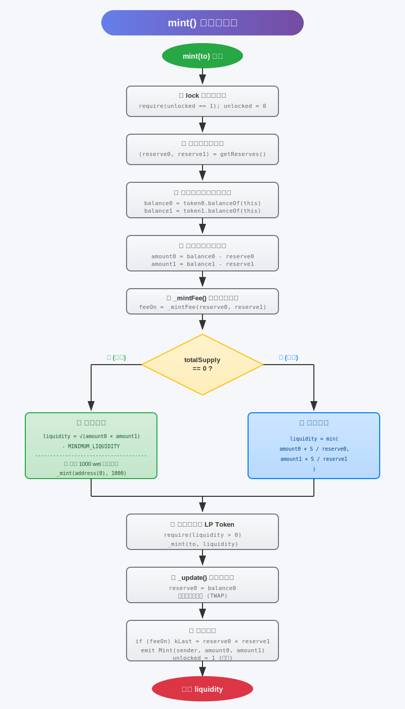
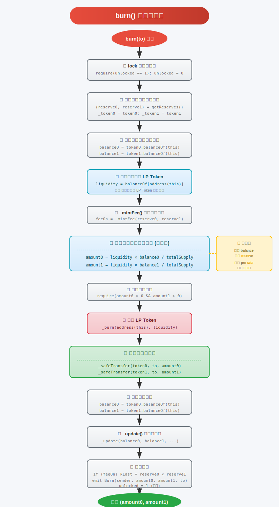

# UniswapV2Pair.sol 合约（上）学习笔记

​																																			2025年12月12日

------

## 📋 目录

1. [合约概述](#合约概述)
2. [合约结构图](#合约结构图)
3. [核心状态变量详解](#核心状态变量详解)
4. [核心函数分析](#核心函数分析)
5. [流程图](#流程图)
6. [源码疑问与解答](#源码疑问与解答)
7. [验证问题解答](#验证问题解答)

---

## 合约概述

`UniswapV2Pair` 是 Uniswap V2 的**核心合约**，实现了：
- **AMM（自动做市商）** 的核心逻辑
- **流动性池**的管理（添加/移除流动性）
- **代币交换**功能
- **价格预言机**功能（TWAP）

### 继承关系
```
IUniswapV2Pair (接口)
       ↑
UniswapV2Pair ──继承──→ UniswapV2ERC20 (LP Token 实现)
```

---

## 合约结构图

```
┌─────────────────────────────────────────────────────────────────────────┐
│                         UniswapV2Pair Contract                          │
├─────────────────────────────────────────────────────────────────────────┤
│  常量 (Constants)                                                        │
│  ├── MINIMUM_LIQUIDITY = 1000 (10^3)    // 最小流动性锁定量              │
│  └── SELECTOR = transfer 函数选择器                                      │
├─────────────────────────────────────────────────────────────────────────┤
│  状态变量 (State Variables)                                              │
│  ├── factory: address          // 工厂合约地址                           │
│  ├── token0: address           // 代币0地址 (按地址排序较小的)            │
│  ├── token1: address           // 代币1地址                              │
│  ├── reserve0: uint112         // 代币0储备量                            │
│  ├── reserve1: uint112         // 代币1储备量                            │
│  ├── blockTimestampLast: uint32 // 上次更新的区块时间戳                   │
│  ├── price0CumulativeLast: uint // token0 价格累计值                     │
│  ├── price1CumulativeLast: uint // token1 价格累计值                     │
│  ├── kLast: uint               // 上次流动性事件后的 k 值                 │
│  └── unlocked: uint            // 重入锁状态                             │
├─────────────────────────────────────────────────────────────────────────┤
│  修饰器 (Modifiers)                                                      │
│  └── lock()                    // 防重入锁                               │
├─────────────────────────────────────────────────────────────────────────┤
│  核心函数 (Core Functions)                                               │
│  ├── initialize()              // 初始化代币对                           │
│  ├── mint()                    // 铸造 LP Token (添加流动性)             │
│  ├── burn()                    // 销毁 LP Token (移除流动性)             │
│  ├── swap()                    // 代币交换                               │
│  ├── skim()                    // 强制余额匹配储备                        │
│  └── sync()                    // 强制储备匹配余额                        │
├─────────────────────────────────────────────────────────────────────────┤
│  内部函数 (Internal Functions)                                           │
│  ├── _update()                 // 更新储备和价格累计器                    │
│  ├── _mintFee()                // 铸造协议费用                           │
│  └── _safeTransfer()           // 安全转账                               │
└─────────────────────────────────────────────────────────────────────────┘
```

---

## 核心状态变量详解

### 1. reserve0, reserve1 (储备量)

```solidity
uint112 private reserve0;  // 代币0的储备量
uint112 private reserve1;  // 代币1的储备量
uint32  private blockTimestampLast;  // 上次更新时间戳
```

**为什么使用 uint112？**

- 三个变量打包在一个 256 位的存储槽中：`112 + 112 + 32 = 256`
- **节省 Gas**：读取一次存储槽即可获取所有三个值
- uint112 最大值约为 5.19 × 10^33，对于大多数代币足够使用

**储备量 vs 实际余额**

```
储备量 (reserve)  ≠  实际余额 (balanceOf)
     ↓                    ↓
  合约记录的值         链上实际持有的代币数量
```


### 2. blockTimestampLast (区块时间戳)

```solidity
uint32 private blockTimestampLast;
```

**作用**：
1. 记录上次更新储备量的区块时间戳
2. 用于计算**时间加权平均价格 (TWAP)** 的时间间隔
3. 使用 `uint32` 存储 `block.timestamp % 2^32`，会在约 136 年后溢出（设计上允许溢出）

**代码位置（75行）**：

```solidity
uint32 blockTimestamp = uint32(block.timestamp % 2**32);
uint32 timeElapsed = blockTimestamp - blockTimestampLast; // overflow is desired
```


### 3. price0CumulativeLast / price1CumulativeLast (价格累计)

```solidity
uint public price0CumulativeLast;  // token1/token0 的累计价格
uint public price1CumulativeLast;  // token0/token1 的累计价格
```

**计算公式**：

**代码位置（79行）**：

```
price0CumulativeLast += (reserve1 / reserve0) * timeElapsed
price1CumulativeLast += (reserve0 / reserve1) * timeElapsed
```

**用途**：实现 **TWAP 预言机**
```
                    price0CumulativeLast(t2) - price0CumulativeLast(t1)
TWAP(t1 → t2) = ─────────────────────────────────────────────────────────
                                    t2 - t1
```

**UQ112x112 定点数**：

- 使用 112 位整数部分 + 112 位小数部分
- 避免浮点数运算，保证精度


### 4. lock 修饰器 (重入锁)

```solidity
uint private unlocked = 1;
modifier lock() {
    require(unlocked == 1, 'UniswapV2: LOCKED');
    unlocked = 0;
    _;
    unlocked = 1;
}
```

**工作原理**：

```
调用 mint/burn/swap
       ↓
检查 unlocked == 1 ✓
       ↓
设置 unlocked = 0 (锁定)
       ↓
执行函数体 (_)
       ↓
设置 unlocked = 1 (解锁)
```

**为什么不用 OpenZeppelin 的 ReentrancyGuard？**

- Uniswap V2 发布时 (2020年)，使用自定义实现更简洁

- 功能相同，都是通过状态变量防止重入

  

### 5. amount0 和 amount1

> 在 UniswapV2Pair 里，amount0 与 amount1 总是按「token0 维度」和「token1 维度」去计量金额，谁在前谁就是 0，谁在后谁就是 1。（参考之前的token排序）
>
> 具体含义要看它们出现在哪个函数里：

- **在 mint（）方法里：**
  - mint()
    amount0 = 本次流动性提供者 **实际转进来的 token0 数量**
    amount1 = 本次流动性提供者 **实际转进来的 token1 数量**
  - 计算方式：
    amount0 = balance0 - _reserve0   // 合约余额增加量
    amount1 = balance1 - _reserve1

- **在 burn（） 方法里：**
  amount0 = 销毁 LP 代币后 **要返还给用户的 token0 数量**
  amount1 = 销毁 LP 代币后 **要返还给用户的 token1 数量**
  计算方式：
  amount0 = liquidity.mul(balance0) / totalSupply   // 按当时余额比例分
  amount1 = liquidity.mul(balance1) / totalSupply

---

## 核心函数分析

### mint() 函数 - 添加流动性

```solidity
function mint(address to) external lock returns (uint liquidity)
```

#### 首次铸造 vs 后续铸造

| 特性 | 首次铸造 | 后续铸造 |
|------|----------|----------|
| 条件 | `totalSupply == 0` | `totalSupply > 0` |
| LP 计算公式 | `√(amount0 × amount1) - 1000` | `min(amount0×S/R0, amount1×S/R1)` |
| MINIMUM_LIQUIDITY | 锁定 1000 wei 到零地址 | 无 |
| 比例要求 | 无 | 必须按当前比例添加 |

#### 首次铸造公式详解

```
liquidity = √(amount0 × amount1) - MINIMUM_LIQUIDITY
```

**为什么用几何平均数？**
- 使 LP Token 价值与两种代币的价值成比例
- 避免单一代币主导 LP Token 价值

#### 后续铸造公式详解

```
liquidity = min(amount0 × totalSupply / reserve0, 
                amount1 × totalSupply / reserve1)
```

**为什么取最小值？**
- 防止用户通过不平衡添加获得额外 LP Token
- 多余的代币会留在池子中（被其他 LP 稀释）

### 为什么首次铸造要锁定 1000 wei LP Token？

```solidity
if (_totalSupply == 0) {
    liquidity = Math.sqrt(amount0.mul(amount1)).sub(MINIMUM_LIQUIDITY);
    _mint(address(0), MINIMUM_LIQUIDITY); // 永久锁定
}
```

**防止"首个流动性提供者攻击"**：

攻击场景（无 MINIMUM_LIQUIDITY）：
```
1. 攻击者存入 1 wei token0 和 1 wei token1
2. 获得 √1 = 1 LP Token
3. 攻击者直接转入大量代币（不通过 mint）
4. 池子变成：1000 ETH + 2000000 USDC，但只有 1 LP Token
5. 每个 LP Token 价值巨大
6. 后续用户添加流动性时，由于整数除法，可能获得 0 LP Token
```

**MINIMUM_LIQUIDITY 如何防止**：
```
1. 首个 LP 必须锁定 1000 wei 到零地址
2. 这 1000 LP Token 永远无法取出
3. 确保 totalSupply 永远 ≥ 1000
4. 攻击成本大幅增加，收益微乎其微
```


### __safeTransfer(_)函数

```solidity
 function _safeTransfer(address token, address to, uint value) private {
        (bool success, bytes memory data) = token.call(abi.encodeWithSelector(SELECTOR, to, value));
        require(success && (data.length == 0 || abi.decode(data, (bool))), 'UniswapV2: TRANSFER_FAILED');
    }
```

1. 把指定数量的代币（value）从合约自己转给目标地址（to）。[^note1]

   [^note1]: “合约自己”并不是指用户，也不是工厂，而是当前这对交易对合约

2. 调用时不用事先 approve，因为它直接用 `token.call` 触发代币合约的 `transfer` 函数。

3. 调用结束后强制检查：

   - 交易必须 success（不能 revert）
   - 如果代币合约返回了布尔值，必须是 true
     不满足就回滚整笔交易，并抛 `UniswapV2: TRANSFER_FAILED`

> 为什么不用 IERC20(token).transfer？
> 因为市面上还有一些“非标准”代币（最典型的 USDT 旧合约）在 transfer 成功时**不返回任何数据**，而 OpenZeppelin 的 SafeERC20 会要求返回 true，否则 revert。
> Uniswap 为了兼容这些“哑巴”代币，就手写了一个“宽松版”安全转账：
>
> - 成功标志：success == true 且（data 长度为 0 或者解码出来是 true）
> - 只要满足上面条件就放过，否则回滚。

### burn() 函数 - 移除流动性

```solidity
function burn(address to) external lock returns (uint amount0, uint amount1)
```

#### 按比例返还公式

```solidity
amount0 = liquidity × balance0 / totalSupply
amount1 = liquidity × balance1 / totalSupply
```

**关键点**：
- 使用 `balance`（实际余额）而非 `reserve`（记录值）
- 确保 pro-rata（按比例）分配
- 即使有人直接转入代币，也会被正确分配

---

## 流程图

### mint() 执行流程

- 执行流程图



------


### burn() 执行流程

- 执行流程图




------


### swap() 执行流程

```
                    swap(amount0Out, amount1Out, to, data)
                                   │
                                   ▼
                    ┌──────────────────────────────┐
                    │   require 输出金额 > 0       │
                    │   require 输出 < 储备量      │
                    └──────────────────────────────┘
                                   │
                                   ▼
                    ┌──────────────────────────────┐
                    │   乐观转账 (先转出代币)      │
                    │   _safeTransfer(token, to)   │
                    └──────────────────────────────┘
                                   │
                                   ▼
                         data.length > 0 ?
                        /                  \
                      是                    否
                      /                      \
                     ▼                        │
    ┌─────────────────────────┐               │
    │   闪电贷回调             │               │
    │   uniswapV2Call()       │               │
    └─────────────────────────┘               │
                      \                      /
                       ▼                    ▼
                    ┌──────────────────────────────┐
                    │   获取新余额                 │
                    │   计算实际输入金额           │
                    └──────────────────────────────┘
                                   │
                                   ▼
                    ┌──────────────────────────────┐
                    │   K 值检验 (含 0.3% 手续费)  │
                    │   bal0Adj × bal1Adj ≥        │
                    │   reserve0 × reserve1 × 10^6 │
                    └──────────────────────────────┘
                                   │
                                   ▼
                    ┌──────────────────────────────┐
                    │   _update() 更新储备量       │
                    │   emit Swap 事件             │
                    └──────────────────────────────┘
```

---

## 源码疑问与解答

### ❓ 疑问 1: 为什么 mint 前要先转入代币？

```solidity
// mint() 中
uint balance0 = IERC20(token0).balanceOf(address(this));
uint balance1 = IERC20(token1).balanceOf(address(this));
uint amount0 = balance0.sub(_reserve0);  // 通过差值计算新增量
uint amount1 = balance1.sub(_reserve1);
```

**原因**：
1. **无需 approve**：用户不需要先 approve 给 Pair 合约
2. **原子性**：Router 合约可以在一个交易中完成转账 + mint
3. **灵活性**：支持任何方式转入代币（transfer、transferFrom 等）
4. **Gas 优化**：减少一次 transferFrom 调用

**实际调用流程**：
```
用户 → Router.addLiquidity()
         │
         ├── transferFrom(user, pair, amount0)
         ├── transferFrom(user, pair, amount1)
         └── pair.mint(to)
```

### ❓ 疑问 2: 为什么 _update 中允许溢出？

```solidity
uint32 timeElapsed = blockTimestamp - blockTimestampLast; // overflow is desired
```

**原因**：
- `uint32` 存储时间戳会在 ~136 年后溢出
- 使用无符号整数减法，即使溢出也能得到正确的时间差
- 例如：`5 - 250 = 11`（在 uint8 中），实际表示经过了 11 个单位

### ❓ 疑问 3: 为什么使用 UQ112x112 定点数？

```solidity
price0CumulativeLast += uint(UQ112x112.encode(_reserve1).uqdiv(_reserve0)) * timeElapsed;
```

**原因**：
1. **精度**：Solidity 不支持浮点数，定点数保证精度
2. **范围**：112 位整数 + 112 位小数，足够表示极端价格比
3. **Gas**：比使用大整数库更省 Gas

### ❓ 疑问 4: 为什么 swap 先转出代币（乐观转账）？

```solidity
if (amount0Out > 0) _safeTransfer(_token0, to, amount0Out); // optimistically transfer
if (amount1Out > 0) _safeTransfer(_token1, to, amount1Out);
// ... 之后才检查 K 值
```

**原因**：
1. **支持闪电贷**：用户可以先拿到代币，在回调中归还
2. **Gas 优化**：减少临时存储
3. **安全性**：最后通过 K 值检验确保不亏损

### ❓ 疑问 5: 为什么 burn 使用 balance 而不是 reserve？

```solidity
amount0 = liquidity.mul(balance0) / _totalSupply;  // 使用 balance
amount1 = liquidity.mul(balance1) / _totalSupply;
```

**原因**：
- 确保**按比例分配**所有代币，包括直接转入的代币
- 防止代币被永久锁定在合约中
- 与 skim() 功能互补

### ❓ 疑问 6: _mintFee 的 1/6 是怎么算出来的？

```solidity
uint numerator = totalSupply.mul(rootK.sub(rootKLast));
uint denominator = rootK.mul(5).add(rootKLast);
uint liquidity = numerator / denominator;
```

**推导**：
- 交易手续费 = 0.3%
- 协议想要获得手续费的 1/6（即 0.05%）
- 通过数学推导，上述公式等价于铸造相当于 √k 增长的 1/6 的 LP Token

---

## 验证问题解答

### 问题 1: 存入 100 ETH 和 200000 USDC，获得多少 LP Token？

**假设**：这是首次添加流动性

**计算**：
```
ETH = 100 × 10^18 = 100000000000000000000 (wei)
USDC = 200000 × 10^6 = 200000000000 (假设 USDC 是 6 位小数)

liquidity = √(amount0 × amount1) - MINIMUM_LIQUIDITY
          = √(100 × 10^18 × 200000 × 10^6) - 1000
          = √(2 × 10^28) - 1000
          = √(2) × 10^14 - 1000
          ≈ 1.414 × 10^14 - 1000
          ≈ 141421356237309 - 1000
          = 141421356236309 wei LP Token
          ≈ 141421.356 LP Token (假设 18 位小数)
```

**如果 USDC 也是 18 位小数**：
```
liquidity = √(100 × 10^18 × 200000 × 10^18) - 1000
          = √(2 × 10^40) - 1000
          = √2 × 10^20 - 1000
          ≈ 1.414 × 10^20 - 1000
          ≈ 141421356237309504880 LP Token (wei)
```

### 问题 2: MINIMUM_LIQUIDITY 如何防止攻击？

**攻击场景（无保护）**：
```
1. 攻击者创建池子，存入 1 wei ETH + 1 wei USDC
2. 获得 1 LP Token
3. 直接转入 100 ETH + 200000 USDC（不调用 mint）
4. 池子：100 ETH + 200000 USDC，totalSupply = 1
5. 受害者存入 1 ETH + 2000 USDC
   计算：min(1e18 × 1 / 100e18, 2000e6 × 1 / 200000e6)
        = min(0.01, 0.01) = 0 (整数除法)
6. 受害者获得 0 LP Token，代币被攻击者窃取！
```

**有 MINIMUM_LIQUIDITY 保护**：
```
1. 攻击者存入 1 wei ETH + 1 wei USDC
2. 获得 √1 - 1000 = 负数 → 交易失败！
3. 攻击者必须存入足够多的代币才能获得 LP Token
4. 即使攻击者存入大量代币，1000 LP Token 被锁定
5. totalSupply 永远 ≥ 1000，后续用户不会因整数除法得到 0
```

### 问题 3: 为什么 mint 前要先转入代币？

见上方 [疑问 1](#❓-疑问-1-为什么-mint-前要先转入代币)

**总结**：
1. 简化用户操作（无需 approve）
2. 支持 Router 合约的原子操作
3. 更灵活的代币转入方式
4. Gas 优化

### 问题 4: 持有 10% LP Token，池子有 100 ETH + 200000 USDC，能取回多少？

**计算**：
```
假设 totalSupply = 1000 LP Token
用户持有 = 100 LP Token (10%)

amount0 = liquidity × balance0 / totalSupply
        = 100 × 100 ETH / 1000
        = 10 ETH

amount1 = liquidity × balance1 / totalSupply
        = 100 × 200000 USDC / 1000
        = 20000 USDC
```

**结论**：持有 10% LP Token 可取回 **10 ETH + 20000 USDC**

---

## 关键设计模式总结

| 设计 | 目的 |
|------|------|
| 存储槽打包 (uint112 × 2 + uint32) | 节省 Gas |
| 重入锁 (lock modifier) | 防止重入攻击 |
| 乐观转账 | 支持闪电贷 |
| MINIMUM_LIQUIDITY | 防止首个 LP 攻击 |
| 价格累计器 | 实现 TWAP 预言机 |
| balance vs reserve | 确保代币不被锁定 |

---

## 学习心得

1. **安全第一**：MINIMUM_LIQUIDITY、重入锁、K 值检验都是安全措施
2. **Gas 优化**：存储槽打包、局部变量缓存、最小化存储写入
3. **灵活设计**：先转账后调用、乐观转账支持多种使用场景
4. **执行流程**：了解mint()和burn()的具体实现方式
5. **数学精妙**：几何平均数、定点数、累计价格的设计都经过精心考量

