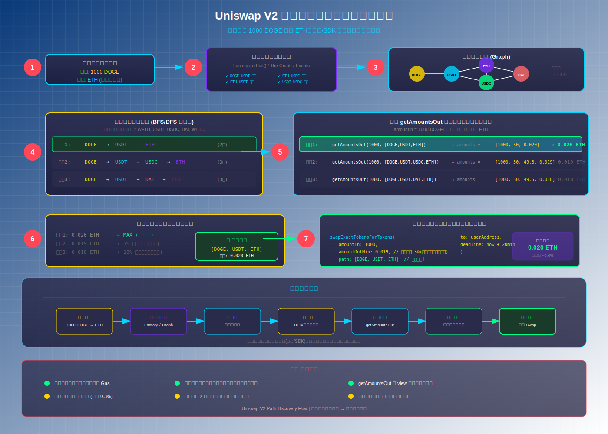

# Uniswap V2 多跳交易（Multi-Hop Swap）详解

## 问题场景

**问题：** 如果我要用 DOGE 兑换 ETH，但是池子里没有 DOGE-ETH 的交易对，只有 DOGE-USDT 和 ETH-USDT 的交易对，这个可以兑换成功吗？

**答案：** ✅ **可以！** Uniswap V2 支持多跳交易（Multi-Hop Swap），可以通过中间代币（如 USDT）来完成兑换。

---

## 核心概念：路径（Path）

在 Uniswap V2 中，`path` 是一个代币地址数组，定义了交易的路由路径：

```solidity
// 直接兑换：DOGE -> ETH（需要 DOGE-ETH 交易对）
path = [DOGE, ETH]

// 多跳兑换：DOGE -> USDT -> ETH（通过 USDT 中转）
path = [DOGE, USDT, ETH]
```

---

## 真实执行流程

### 场景设定
- 用户想用 **1000 DOGE** 兑换 **ETH**
- 存在交易对：**DOGE-USDT** 和 **ETH-USDT**
- 不存在交易对：**DOGE-ETH**

### 执行路径
```
DOGE → USDT → ETH
```

### 详细步骤

```
┌─────────────────────────────────────────────────────────────────────────────┐
│                           用户调用 Router 合约                               │
│         swapExactTokensForTokens(1000 DOGE, path=[DOGE,USDT,ETH])           │
└─────────────────────────────────────────────────────────────────────────────┘
                                      │
                                      ▼
┌─────────────────────────────────────────────────────────────────────────────┐
│  Step 1: 计算所有中间金额 (getAmountsOut)                                    │
│  ─────────────────────────────────────────────────────────────────────────  │
│  amounts[0] = 1000 DOGE (输入)                                              │
│  amounts[1] = ? USDT   (通过 DOGE-USDT 池计算)                              │
│  amounts[2] = ? ETH    (通过 ETH-USDT 池计算)                               │
└─────────────────────────────────────────────────────────────────────────────┘
                                      │
                                      ▼
┌─────────────────────────────────────────────────────────────────────────────┐
│  Step 2: 转移 DOGE 到第一个交易对                                            │
│  ─────────────────────────────────────────────────────────────────────────  │
│  用户钱包 ──[1000 DOGE]──> DOGE-USDT Pair 合约                              │
└─────────────────────────────────────────────────────────────────────────────┘
                                      │
                                      ▼
┌─────────────────────────────────────────────────────────────────────────────┐
│  Step 3: 第一跳 - DOGE → USDT                                               │
│  ─────────────────────────────────────────────────────────────────────────  │
│  DOGE-USDT Pair.swap()                                                      │
│  • 输入: 1000 DOGE                                                          │
│  • 输出: amounts[1] USDT                                                    │
│  • 接收方: ETH-USDT Pair 合约 (下一个池子！)                                 │
│                                                                             │
│  ⚠️ 关键优化：USDT 直接发送到下一个池子，不经过用户钱包                        │
└─────────────────────────────────────────────────────────────────────────────┘
                                      │
                                      ▼
┌─────────────────────────────────────────────────────────────────────────────┐
│  Step 4: 第二跳 - USDT → ETH                                                │
│  ─────────────────────────────────────────────────────────────────────────  │
│  ETH-USDT Pair.swap()                                                       │
│  • 输入: amounts[1] USDT                                                    │
│  • 输出: amounts[2] ETH                                                     │
│  • 接收方: 用户钱包 (最终目的地)                                             │
└─────────────────────────────────────────────────────────────────────────────┘
                                      │
                                      ▼
┌─────────────────────────────────────────────────────────────────────────────┐
│  ✅ 交易完成！用户收到 ETH                                                   │
└─────────────────────────────────────────────────────────────────────────────┘
```

---

## 🔑 路径（Path）是如何计算出来的？

### 核心问题

> 池子里的代币对那么多，合约怎么知道要跳 2 次？path 又是怎么计算出来的？

### 答案

**path 不是合约自动计算的！** 合约只负责执行，路径的计算完全在**链下（前端/SDK）**完成。

```
┌─────────────────────────────────────────────────────────────────────────────┐
│                              架构分层                                        │
├─────────────────────────────────────────────────────────────────────────────┤
│                                                                             │
│   ┌─────────────────────────────────────────────────────────────────────┐   │
│   │  前端 / SDK 层（链下）                                               │   │
│   │  ─────────────────────────────────────────────────────────────────  │   │
│   │  • 查询所有可用交易对                                                │   │
│   │  • 构建交易对图（Graph）                                             │   │
│   │  • 使用图算法寻找最优路径                                            │   │
│   │  • 计算每条路径的预期输出                                            │   │
│   │  • 选择输出最大的路径                                                │   │
│   └─────────────────────────────────────────────────────────────────────┘   │
│                                    │                                        │
│                                    │ path = [DOGE, USDT, ETH]               │
│                                    ▼                                        │
│   ┌─────────────────────────────────────────────────────────────────────┐   │
│   │  智能合约层（链上）                                                  │   │
│   │  ─────────────────────────────────────────────────────────────────  │   │
│   │  • 接收 path 参数                                                   │   │
│   │  • 验证路径有效性（交易对必须存在）                                   │   │
│   │  • 按 path 顺序执行每一跳                                           │   │
│   │  • 不做任何路径优化                                                  │   │
│   └─────────────────────────────────────────────────────────────────────┘   │
│                                                                             │
└─────────────────────────────────────────────────────────────────────────────┘
```

### 前端如何获取链上交易对信息？

前端/SDK 通过**读取链上数据**来获取交易对信息，主要有以下几种方式：

#### 方式 1: 从 Factory 合约查询

Factory 合约存储了所有交易对的信息：

```solidity
// UniswapV2Factory.sol 关键数据结构

// 通过两个代币地址查询交易对地址
mapping(address => mapping(address => address)) public getPair;

// 存储所有交易对地址的数组
address[] public allPairs;

// 获取交易对总数
function allPairsLength() external view returns (uint);
```

**查询示例：**

```javascript
// 1. 查询特定代币对是否存在
const pairAddress = await factory.getPair(DOGE_ADDRESS, USDT_ADDRESS);
if (pairAddress !== '0x0000000000000000000000000000000000000000') {
    console.log('DOGE-USDT 交易对存在:', pairAddress);
}

// 2. 遍历所有交易对
const totalPairs = await factory.allPairsLength();
for (let i = 0; i < totalPairs; i++) {
    const pairAddress = await factory.allPairs(i);
    const pair = new ethers.Contract(pairAddress, PAIR_ABI, provider);
    const token0 = await pair.token0();
    const token1 = await pair.token1();
    console.log(`Pair ${i}: ${token0} - ${token1}`);
}
```

#### 方式 2: 监听 PairCreated 事件

Factory 合约在创建新交易对时会触发事件：

```solidity
event PairCreated(address indexed token0, address indexed token1, address pair, uint);
```

**前端监听：**

```javascript
// 监听新交易对创建
factory.on('PairCreated', (token0, token1, pairAddress, pairIndex) => {
    console.log(`新交易对创建: ${token0}-${token1} at ${pairAddress}`);
    // 更新本地交易对缓存
    updatePairCache(token0, token1, pairAddress);
});

// 查询历史事件获取所有交易对
const filter = factory.filters.PairCreated();
const events = await factory.queryFilter(filter, 0, 'latest');
events.forEach(event => {
    const { token0, token1, pair } = event.args;
    // 构建交易对图
});
```

#### 方式 3: 使用 The Graph 子图（推荐）

Uniswap 官方部署了 **The Graph 子图**，索引了所有链上数据：

```graphql
# GraphQL 查询所有交易对
{
  pairs(first: 1000, orderBy: reserveUSD, orderDirection: desc) {
    id
    token0 {
      id
      symbol
    }
    token1 {
      id
      symbol
    }
    reserveUSD
  }
}
```

**优势：**
- 无需遍历链上数据，查询速度快
- 可以按流动性排序，优先使用深度好的池子
- 支持复杂查询和过滤

#### 方式 4: 使用 CREATE2 预计算地址

由于 Uniswap V2 使用 CREATE2 创建交易对，地址是**确定性的**，可以直接计算：

```solidity
// UniswapV2Library.sol
function pairFor(address factory, address tokenA, address tokenB) 
    internal pure returns (address pair) 
{
    (address token0, address token1) = sortTokens(tokenA, tokenB);
    pair = address(uint(keccak256(abi.encodePacked(
        hex'ff',
        factory,
        keccak256(abi.encodePacked(token0, token1)),
        hex'25aad938d8616b6e59148d3e701e4966de4418a752233589352d7c616a256568' // init code hash
    ))));
}
```

**前端可以直接计算地址，然后检查是否有代码：**

```javascript
const pairAddress = computePairAddress(DOGE, USDT);
const code = await provider.getCode(pairAddress);
const pairExists = code !== '0x';  // 如果有代码，说明交易对存在
```

### 实际路径搜索策略

由于遍历所有交易对成本太高，实际使用的是**启发式搜索**：

```
┌─────────────────────────────────────────────────────────────────────────────┐
│                         实际路径搜索策略                                     │
├─────────────────────────────────────────────────────────────────────────────┤
│                                                                             │
│  1. 直接路径检查                                                            │
│     检查 DOGE-ETH 是否存在 → 不存在，继续                                   │
│                                                                             │
│  2. 通过基础代币中转（只检查常用代币）                                       │
│     ┌─────────────────────────────────────────────────────────────────┐     │
│     │  基础代币列表: [WETH, USDT, USDC, DAI, WBTC]                    │     │
│     │                                                                 │     │
│     │  检查路径:                                                      │     │
│     │  • DOGE → WETH → ETH  (检查 DOGE-WETH 和 WETH-ETH)             │     │
│     │  • DOGE → USDT → ETH  (检查 DOGE-USDT 和 USDT-ETH) ✅ 存在     │     │
│     │  • DOGE → USDC → ETH  (检查 DOGE-USDC 和 USDC-ETH)             │     │
│     │  • ...                                                          │     │
│     └─────────────────────────────────────────────────────────────────┘     │
│                                                                             │
│  3. 比较所有有效路径的输出，选择最优                                         │
│                                                                             │
└─────────────────────────────────────────────────────────────────────────────┘
```

**关键优化：不遍历所有交易对，只检查通过常用基础代币的路径！**

---

### 路径发现算法详解

#### Step 1: 构建交易对图

前端首先从 Factory 合约获取所有已创建的交易对，构建一个图结构：

```
                    ┌─────────┐
          ┌─────────│  WETH   │─────────┐
          │         └─────────┘         │
          │              │              │
     [ETH-USDT]     [ETH-USDC]     [ETH-DAI]
          │              │              │
          ▼              ▼              ▼
     ┌─────────┐   ┌─────────┐   ┌─────────┐
     │  USDT   │───│  USDC   │───│   DAI   │
     └─────────┘   └─────────┘   └─────────┘
          │
     [DOGE-USDT]
          │
          ▼
     ┌─────────┐
     │  DOGE   │
     └─────────┘

图中每条边代表一个存在的交易对
```

#### Step 2: 寻找所有可能路径

从 DOGE 到 ETH，可能的路径有：

```
路径 1: DOGE → USDT → ETH        (2 跳)
路径 2: DOGE → USDT → USDC → ETH (3 跳)
路径 3: DOGE → USDT → DAI → ETH  (3 跳)
...
```

#### Step 3: 计算每条路径的输出

对于每条路径，调用 `getAmountsOut` 计算预期输出。

##### 参数解释

| 参数 | 含义 | 示例 |
|------|------|------|
| **amountIn** | 用户想要卖出的输入代币数量 | `1000 DOGE`（用户想用 1000 个 DOGE 换 ETH） |
| **path** | 交易路径，代币地址数组 | `[DOGE, USDT, ETH]` |
| **amounts** | 返回值，每一跳的金额数组 | `[1000, 50, 0.02]`（见下方详解） |

##### amounts 返回格式详解

`amounts` 是一个数组，长度等于 `path.length`，记录了**每一步的代币数量**：

```
path    = [DOGE,  USDT,  ETH ]
amounts = [1000,  50,    0.02]
           ↑      ↑      ↑
           │      │      └── 最终得到 0.02 ETH
           │      └── 中间得到 50 USDT
           └── 输入 1000 DOGE
```

##### 具体兑换示例

假设用户想用 **1000 DOGE** 换 **ETH**，下面是真实执行的流程图：



##### 最优路径选择代码

```javascript
// amountIn = 用户想卖出的 DOGE 数量
const amountIn = ethers.utils.parseUnits("1000", 8);  // 1000 DOGE (8位小数)

const paths = [
    [DOGE, USDT, ETH],
    [DOGE, USDT, USDC, ETH],
    [DOGE, USDT, DAI, ETH]
];

let bestPath = null;
let bestOutput = 0;

for (const path of paths) {
    // getAmountsOut 返回每一跳的金额数组
    // 例如: [1000 DOGE, 50 USDT, 0.02 ETH]
    const amounts = await router.getAmountsOut(amountIn, path);
    
    // 取数组最后一个元素 = 最终能得到的 ETH 数量
    const output = amounts[amounts.length - 1];
    
    console.log(`路径 ${path.map(t => t.symbol).join(' → ')}`);
    console.log(`  amounts: ${amounts.map(a => a.toString())}`);
    console.log(`  最终输出: ${ethers.utils.formatEther(output)} ETH`);
    
    // 比较，保留输出最大的路径
    if (output.gt(bestOutput)) {  // BigNumber 比较用 .gt()
        bestOutput = output;
        bestPath = path;
    }
}

console.log(`\n最优路径: ${bestPath.map(t => t.symbol).join(' → ')}`);
console.log(`最优输出: ${ethers.utils.formatEther(bestOutput)} ETH`);

// 输出示例:
// 路径 DOGE → USDT → ETH
//   amounts: [100000000000, 5000000000, 20000000000000000]
//   最终输出: 0.02 ETH
// 路径 DOGE → USDT → USDC → ETH
//   amounts: [100000000000, 5000000000, 4980000000, 19000000000000000]
//   最终输出: 0.019 ETH
// ...
// 最优路径: DOGE → USDT → ETH
// 最优输出: 0.02 ETH
```

##### 为什么路径 1 输出最多？

| 因素 | 说明 |
|------|------|
| **跳数少** | 每跳收 0.3% 手续费，2 跳 vs 3 跳 |
| **手续费累计** | 路径 1: 0.997² ≈ 99.4%<br>路径 2: 0.997³ ≈ 99.1% |
| **滑点累计** | 跳数越多，价格影响越大 |

**结论：通常跳数越少越好，但如果中间池子流动性很差，多跳反而可能更优。**

#### Step 4: 选择最优路径

考虑因素：
- **输出金额**：选择输出最大的路径
- **Gas 成本**：跳数越多，Gas 越高
- **滑点影响**：大额交易可能需要拆分到多条路径

### 常见中间代币（Base Tokens）

为了简化路径搜索，通常只考虑通过以下"基础代币"中转：

| 代币 | 说明 |
|------|------|
| **WETH** | 最常用的中间代币，流动性最好 |
| **USDT** | 稳定币，与大多数代币有交易对 |
| **USDC** | 稳定币 |
| **DAI** | 去中心化稳定币 |
| **WBTC** | 比特币锚定币 |

### Uniswap SDK 路径计算示例

```typescript
import { Token, Pair, Route, Trade, TradeType } from '@uniswap/v2-sdk'

// 定义代币
const DOGE = new Token(1, '0x...', 8, 'DOGE')
const USDT = new Token(1, '0x...', 6, 'USDT')
const WETH = new Token(1, '0x...', 18, 'WETH')

// 获取交易对（需要从链上查询储备量）
const pair_DOGE_USDT = new Pair(/* ... */)
const pair_USDT_WETH = new Pair(/* ... */)

// 构建路由（SDK 自动处理路径）
const route = new Route(
    [pair_DOGE_USDT, pair_USDT_WETH],  // 交易对序列
    DOGE,                               // 输入代币
    WETH                                // 输出代币
)

// route.path = [DOGE, USDT, WETH]  ← 这就是传给合约的 path！

// 创建交易
const trade = new Trade(
    route,
    CurrencyAmount.fromRawAmount(DOGE, '1000000000'),
    TradeType.EXACT_INPUT
)

// 获取调用参数
const { methodName, args } = Router.swapCallParameters(trade, {
    slippageTolerance: new Percent('50', '10000'),  // 0.5% 滑点
    deadline: Math.floor(Date.now() / 1000) + 60 * 20
})

// args 包含: [amountIn, amountOutMin, path, to, deadline]
```

### 为什么合约不自动计算路径？

| 原因 | 说明 |
|------|------|
| **Gas 成本** | 链上图搜索算法消耗大量 Gas |
| **复杂度** | 需要遍历所有交易对，计算量巨大 |
| **灵活性** | 用户/聚合器可以自定义路由策略 |
| **确定性** | 链上计算可能因区块不同导致路径变化 |

### 路径验证

合约虽然不计算路径，但会**验证路径有效性**：

```solidity
// UniswapV2Library.sol
function getAmountsOut(...) {
    require(path.length >= 2, 'UniswapV2Library: INVALID_PATH');
    
    for (uint i; i < path.length - 1; i++) {
        // 获取储备量时会检查交易对是否存在
        (uint reserveIn, uint reserveOut) = getReserves(factory, path[i], path[i + 1]);
        // 如果交易对不存在，getReserves 会 revert
    }
}
```

如果传入的 path 中任意相邻两个代币没有交易对，交易会失败。

---

## 核心代码解析

### 1. Router 合约 - swapExactTokensForTokens

```solidity
// 文件: UniswapV2Router02.sol

function swapExactTokensForTokens(
    uint amountIn,           // 输入金额 (1000 DOGE)
    uint amountOutMin,       // 最小输出金额 (滑点保护)
    address[] calldata path, // 路径 [DOGE, USDT, ETH]
    address to,              // 接收地址
    uint deadline            // 截止时间
) external returns (uint[] memory amounts) {
    // 1. 计算每一跳的输出金额
    amounts = UniswapV2Library.getAmountsOut(factory, amountIn, path);
    
    // 2. 检查最终输出是否满足最小要求
    require(amounts[amounts.length - 1] >= amountOutMin, 
            'UniswapV2Router: INSUFFICIENT_OUTPUT_AMOUNT');
    
    // 3. 将输入代币转到第一个交易对
    TransferHelper.safeTransferFrom(
        path[0],                                              // DOGE
        msg.sender,                                           // 用户
        UniswapV2Library.pairFor(factory, path[0], path[1]), // DOGE-USDT Pair
        amounts[0]                                            // 1000 DOGE
    );
    
    // 4. 执行链式交换
    _swap(amounts, path, to);
}
```

### 2. 链式交换核心逻辑 - _swap

```solidity
function _swap(uint[] memory amounts, address[] memory path, address _to) internal {
    for (uint i; i < path.length - 1; i++) {
        (address input, address output) = (path[i], path[i + 1]);
        (address token0,) = UniswapV2Library.sortTokens(input, output);
        uint amountOut = amounts[i + 1];
        
        // 确定输出方向
        (uint amount0Out, uint amount1Out) = input == token0 
            ? (uint(0), amountOut) 
            : (amountOut, uint(0));
        
        // 🔑 关键：确定接收地址
        // 如果不是最后一跳，接收地址是下一个交易对
        // 如果是最后一跳，接收地址是用户
        address to = i < path.length - 2 
            ? UniswapV2Library.pairFor(factory, output, path[i + 2])  // 下一个池子
            : _to;  // 用户地址
        
        // 执行交换
        IUniswapV2Pair(UniswapV2Library.pairFor(factory, input, output))
            .swap(amount0Out, amount1Out, to, new bytes(0));
    }
}
```

### 3. 金额计算 - getAmountsOut

```solidity
// 文件: UniswapV2Library.sol

// 链式计算每一跳的输出金额
function getAmountsOut(
    address factory, 
    uint amountIn, 
    address[] memory path
) internal view returns (uint[] memory amounts) {
    require(path.length >= 2, 'UniswapV2Library: INVALID_PATH');
    amounts = new uint[](path.length);
    amounts[0] = amountIn;  // 初始输入
    
    // 遍历每一跳
    for (uint i; i < path.length - 1; i++) {
        // 获取当前交易对的储备量
        (uint reserveIn, uint reserveOut) = getReserves(factory, path[i], path[i + 1]);
        // 计算输出金额（扣除 0.3% 手续费）
        amounts[i + 1] = getAmountOut(amounts[i], reserveIn, reserveOut);
    }
}

// 单跳金额计算（含 0.3% 手续费）
function getAmountOut(
    uint amountIn, 
    uint reserveIn, 
    uint reserveOut
) internal pure returns (uint amountOut) {
    uint amountInWithFee = amountIn * 997;  // 扣除 0.3% 手续费
    uint numerator = amountInWithFee * reserveOut;
    uint denominator = reserveIn * 1000 + amountInWithFee;
    amountOut = numerator / denominator;
}
```

---

## 手续费计算

每一跳都会收取 **0.3%** 的手续费：

| 跳数 | 累计手续费 | 剩余比例 |
|------|-----------|---------|
| 1跳  | 0.3%      | 99.7%   |
| 2跳  | ~0.6%     | 99.4%   |
| 3跳  | ~0.9%     | 99.1%   |

**示例计算（DOGE → USDT → ETH）：**
- 输入: 1000 DOGE
- 第一跳后: 1000 × 0.997 = 997 DOGE 等值的 USDT
- 第二跳后: USDT数量 × 0.997 = 最终 ETH

---

## Gas 优化设计

Uniswap V2 的多跳交易有一个关键优化：

```
❌ 低效方式：DOGE → 用户钱包 → USDT → 用户钱包 → ETH
✅ 高效方式：DOGE → DOGE-USDT池 → ETH-USDT池 → 用户钱包
```

中间代币**直接从一个池子转到下一个池子**，不经过用户钱包，节省了 Gas。

---

## 前端调用示例

```javascript
// 使用 ethers.js 调用多跳交易
const router = new ethers.Contract(ROUTER_ADDRESS, ROUTER_ABI, signer);

const path = [
    DOGE_ADDRESS,   // 输入代币
    USDT_ADDRESS,   // 中间代币
    WETH_ADDRESS    // 输出代币 (ETH 用 WETH 表示)
];

const amountIn = ethers.utils.parseUnits("1000", 8);  // 1000 DOGE
const amountOutMin = 0;  // 生产环境应设置滑点保护
const deadline = Math.floor(Date.now() / 1000) + 60 * 20;  // 20分钟

// 先授权
await dogeToken.approve(ROUTER_ADDRESS, amountIn);

// 执行交换
const tx = await router.swapExactTokensForTokens(
    amountIn,
    amountOutMin,
    path,
    userAddress,
    deadline
);
```

---

## 总结

| 特性 | 说明 |
|------|------|
| **是否支持** | ✅ 完全支持多跳交易 |
| **路径长度** | 理论上无限制，实际受 Gas 限制 |
| **手续费** | 每跳 0.3%，累计计算 |
| **Gas 优化** | 中间代币直接池对池转移 |
| **滑点风险** | 跳数越多，滑点风险越大 |

**核心原理：** Router 合约通过 `path` 参数定义交易路径，`_swap` 函数循环执行每一跳，将中间代币直接发送到下一个池子，最后一跳才发送到用户地址。
